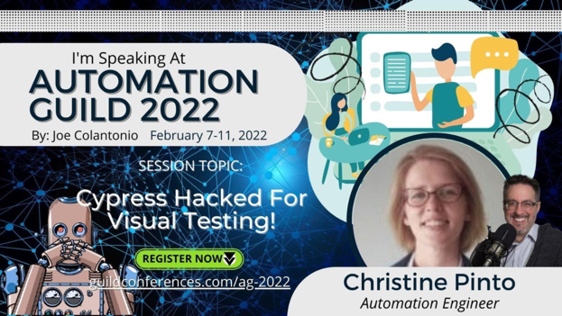

 

<h1 align="center"></h1>

# Cypress Hacked! for Visual Testing

You can find my slides [here](<./slideDeck/AutomationGuild_Cypress Hacked.pdf>)

This Talk was about how I hacked Cypress to optimise and stabalise my testsuite.

The 3 main topics are:

- Highlight Text
- Multiple Elements
- All about Images

You can find the talk to this repository at the Automation Guild 2022.
